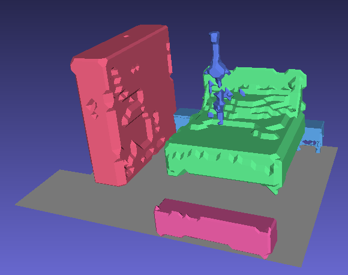
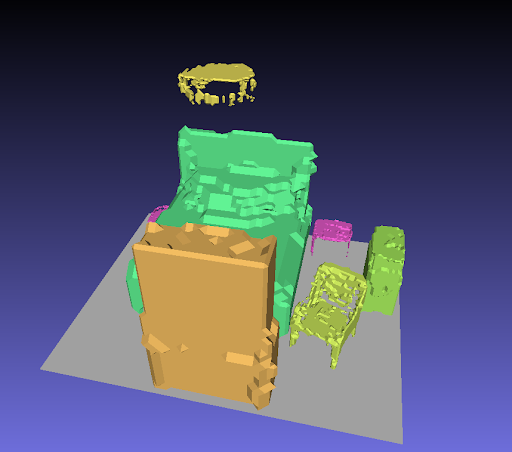
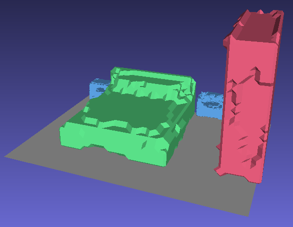

## End-to-End Learning for Indoor Scene Synthesis using Low-Dimensional Representations 

<p align="center">
    
    
    
</p>


This is the project repository for the Advanced Deep Learning for Computer Vision project.

This project aims to develop an end-to-end method for interior scene synthesis by using low-dimensional representations of scene furniture. To this end, we adopt the autoregressive architecture of previous works and enhance them with our shape codes, representing 3D objects in a low-dimensional space. Whereas past works regress only class, 3D position, orientation, and sizes, we regress a per-object shape code. These deep features will correspond to the latent space of an autoencoder pre-trained on Voxel grids. Using the decoder part of this autoencoder and our shape codes, we obtain 3D voxel grids that we re-mesh using a regular marching cubes procedure. Therefore, the autoencoder has two meaningful jobs:
- Provide ground truth labels for objects present in our furniture dataset (3D-FUTURE)
- Provide a mean to convert our regressed shape codes into full 3D models.

The report for this project can be found [here](./assets/pdf/Report.pdf).

## Installation & Dependencies

The simplest way to make sure that you have all dependencies in place is to use
[conda](https://docs.conda.io/projects/conda/en/4.6.1/index.html). You can
create a conda environment called ```adlproject``` using
```
conda env create -f environment.yml
conda activate adlproject
```

To set up ATISS, follow the instructions in the readme belonging to it.
The structure of the `datasets` folder (directly below ATISS/) should be as follows:
 - datasets
   - 3D-Front/ -> /home/usr/Documents/Data/3D-FRONT/
   - 3D-Future/ -> /home/usr/Documents/Data/3D-FRONT/3D-FUTURE-model/
   - process_outputs/
   - threed_future_model_bedroom.pkl
   - threed_future_model_livingroom.pkl

where 3D-Front/3D-Future are symbolic links.

## Dataset
The project is based on the 
[3D-FUTURE](https://www.google.com/search?q=3d-future&oq=3d-fut&aqs=chrome.1.69i57j0j0i30l8.3909j0j7&sourceid=chrome&ie=UTF-8)
dataset. The dataset can be obtained in [this webpage](https://tianchi.aliyun.com/specials/promotion/alibaba-3d-scene-dataset).

### Data Preprocessing

Once you have downloaded the dataset you need to run the `preprocess_data.py` script in the autoencoder folder to prepare the data for training. To run the preprocessing script run

```
python preprocess_data.py path_to_output_dir path_to_3d_future_dataset_dir -p
```

The ```-p``` flag tries to parallelize processing for better performance. The script produces a pickle file which takes the 3D-FUTURE dataset and transforms each object into a:
- model name
- label
- a $32\times 32 \times 32$ voxel grid

### Training Autoencoder

To train the autoencoder for scratch, used for shape generation, run: 

```
python train.py --data_root threed_future_pickle_path
```

You may also adjust the size of the bottleneck layer by specifying the ```--z_dim``` argument.

## Training Autoregressive network

We base our implementation from [ATISS](https://github.com/nv-tlabs/ATISS). To learn more about the training and scene generation scripts, see this [README](ATISS/README.md).

Before you use any of these scripts, we need to encode the shapes of the 3D-FUTURE dataset using our pretrained encoder. These codes will be used for training and scene generation. To perform the encoding, simply run 

```
python preprocess.py --data_root threed_future_pickle_path --pretrained_model_path autoencoder_model_path
```

## Evaluation

The autoencoder and the auto-regressive network can be tested using the following scripts: 

```
python evaluate_autoencoder.py --data_root pickled_model_path --pretrained_model_path model_path
```

```
python evaluate.py config_file output_directory --path_to_pickled_3d_future_models pickled_model_path
```

These calculate the Chamfer Distances of the autoencoder reconstructions and the Chamfer Distances of the objects in the 3D-FRONT scenes respectively.